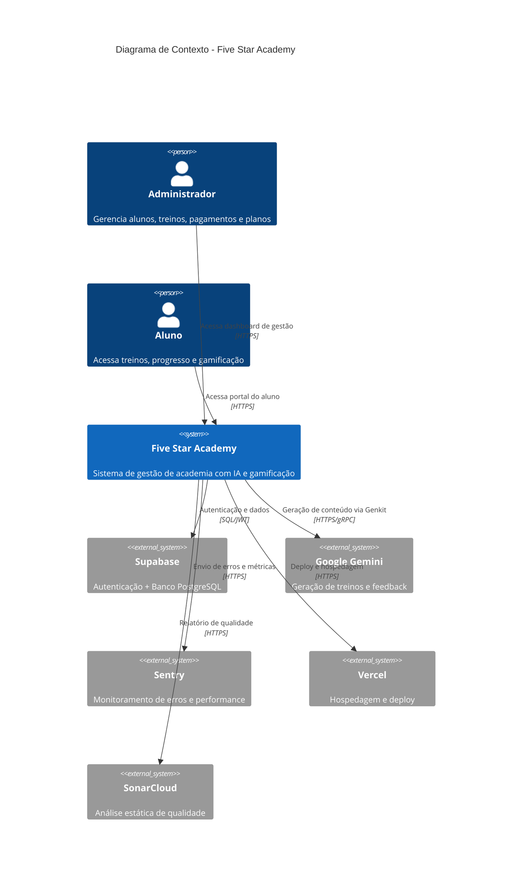
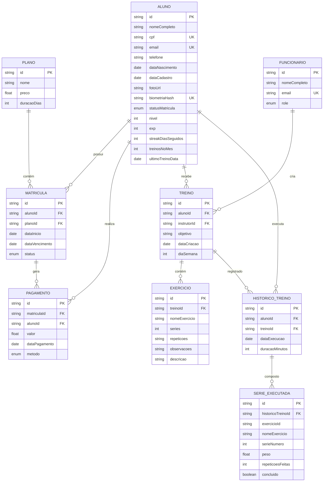
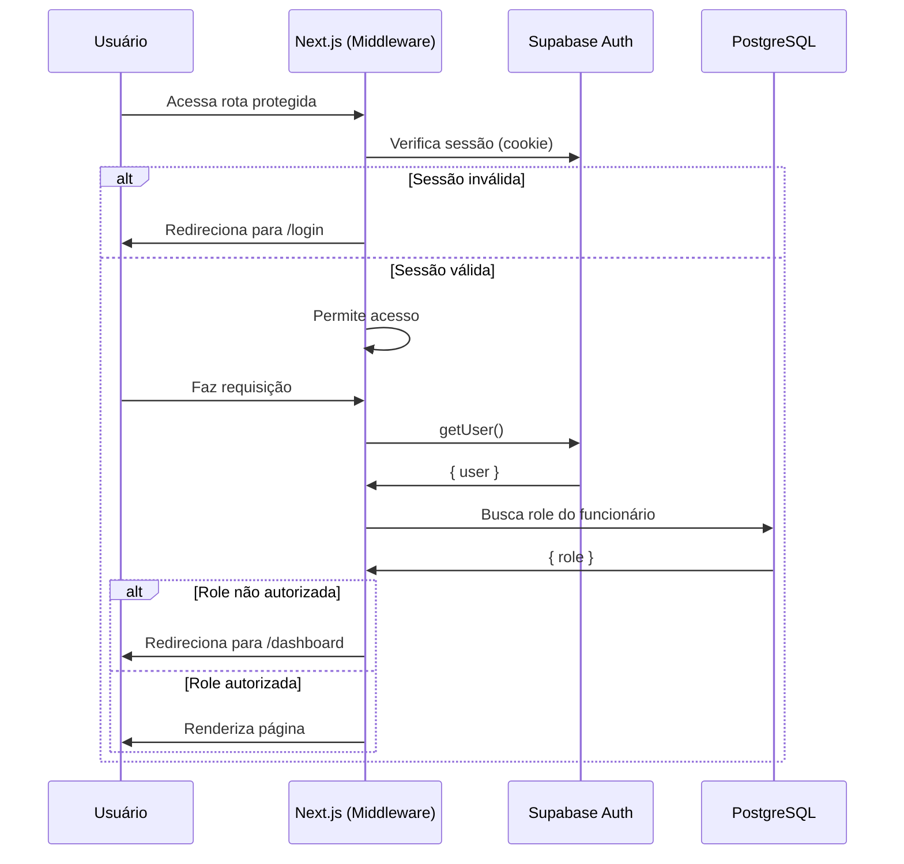
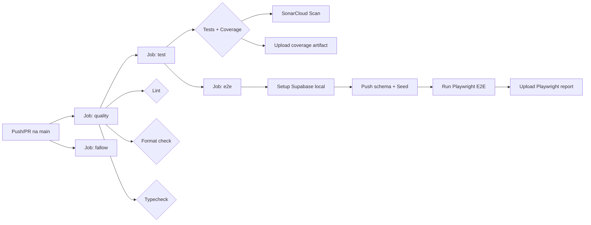

# Documento de Projeto Arquitetural

## Five Star Academy - Sistema de Gestão Acadêmica

| Campo       | Detalhe                                           |
| ----------- | ------------------------------------------------- |
| **Projeto** | Five Star Academy - Sistema de Gestão de Academia |
| **Versão**  | 1.0.0                                             |
| **Data**    | Julho de 2026                                     |
| **Autor**   | José Inamar de Medeiros Júnior                    |

---

## Histórico de Revisões

| Data     | Versão | Descrição                                | Autor                          |
| -------- | ------ | ---------------------------------------- | ------------------------------ |
| Jul/2026 | 1.0    | Versão inicial do documento arquitetural | José Inamar de Medeiros Júnior |

---

## 1. Introdução e Objetivo do Documento

### 1.1 Propósito

Este documento descreve a arquitetura de software do sistema **Five Star Academy**, uma aplicação full-stack moderna para gestão de academias. O sistema combina ferramentas administrativas para o gerenciamento de alunos, matrículas, pagamentos e treinos com uma experiência gamificada para o aluno, potencializada por Inteligência Artificial Generativa.

O documento tem como objetivo apresentar a visão arquitetural completa do sistema, abrangendo desde a estrutura de frontend e backend até os aspectos de infraestrutura, segurança e qualidade. Ele se destina a engenheiros de software, arquitetos, mantenedores do projeto e avaliadores acadêmicos.

### 1.2 Escopo

O escopo deste documento cobre:

- Arquitetura de frontend (Next.js App Router, React 19, Tailwind CSS 4, shadcn/ui)
- Arquitetura de backend (Server Actions, Prisma ORM, PostgreSQL no Supabase)
- Modelagem de dados e esquema Prisma
- Autenticação e autorização (Supabase Auth SSR)
- Integração com IA (Google Genkit e Gemini)
- Observabilidade (Sentry, logging, telemetria)
- Estratégia de testes (Vitest, Playwright)
- Pipeline de CI/CD (GitHub Actions, SonarCloud, Vercel)
- Decisões de design e padrões arquiteturais

### 1.3 Definições, Acrônimos e Abreviações

| Termo     | Definição                                      |
| --------- | ---------------------------------------------- |
| **SSR**   | Server-Side Rendering                          |
| **RSC**   | React Server Component                         |
| **SPA**   | Single Page Application                        |
| **ORM**   | Object-Relational Mapping                      |
| **FPA**   | Function Point Analysis                        |
| **PII**   | Personally Identifiable Information            |
| **E2E**   | End-to-End (testes)                            |
| **CI/CD** | Continuous Integration / Continuous Deployment |
| **API**   | Application Programming Interface              |
| **JWT**   | JSON Web Token                                 |

---

## 2. Visão Geral da Arquitetura

O Five Star Academy adota uma arquitetura **full-stack monolítica moderna** construída sobre o Next.js 15 com App Router. Diferente de uma separação clássica entre frontend e backend, o Next.js unifica ambas as camadas em um único projeto, utilizando o modelo de **React Server Components (RSC)** para renderização no servidor e **Server Actions** para mutações de dados.

### 2.1 Diagrama de Contexto (Nível 1 - C4 Model)



### 2.2 Princípios Arquiteturais

1. **Server-first**: Máximo de processamento no servidor. Componentes são Server Components por padrão; Client Components apenas quando interatividade é necessária.
2. **Fail-closed**: Segurança por padrão. Qualquer erro de autenticação ou banco redireciona o usuário para uma rota segura, nunca expõe dados.
3. **Separação de responsabilidades**: Camada de serviços (`src/services/`) isolada da camada de apresentação; lógica de negócio não vaza para componentes.
4. **Observabilidade desde o início**: Todo erro significativo é capturado pelo Sentry via Logger centralizado.
5. **Privacidade por design**: Filtro recursivo de PII no servidor e cliente para remoção de dados sensíveis (CPF, senhas) antes do envio a serviços externos.
6. **Qualidade automatizada**: TypeScript strict, linting, formatação e testes são portões de qualidade obrigatórios via pipeline CI.

### 2.3 Stack Tecnológica

| Camada           | Tecnologia             | Versão  |
| ---------------- | ---------------------- | ------- |
| Framework        | Next.js                | 15.5.15 |
| Linguagem        | TypeScript             | 6.0.3   |
| Runtime          | Node.js                | 22+     |
| UI Library       | React                  | 19.2.7  |
| Estilização      | Tailwind CSS           | 4.2.2   |
| Componentes      | shadcn/ui (Radix UI)   | -       |
| Animações        | motion (Framer Motion) | 12.40.0 |
| Ícones           | Lucide React           | 1.17.0  |
| ORM              | Prisma                 | 7.7.0   |
| Banco            | PostgreSQL (Supabase)  | -       |
| Autenticação     | Supabase Auth SSR      | -       |
| Validação        | Zod                    | 3.25.76 |
| Formulários      | React Hook Form        | 7.77.0  |
| IA Engine        | Google Genkit          | 1.36.0  |
| Modelo IA        | Gemini (Google AI)     | -       |
| Testes unitários | Vitest                 | 4.1.7   |
| Testes E2E       | Playwright             | 1.59.1  |
| Monitoramento    | Sentry                 | 10.56.0 |
| CI/CD            | GitHub Actions         | -       |
| Qualidade        | SonarCloud             | -       |
| Deploy           | Vercel                 | -       |

---

## 3. Arquitetura de Frontend

### 3.1 Estrutura de Rotas (App Router)

O Next.js App Router organiza a aplicação em rotas baseadas no sistema de arquivos. O Five Star Academy possui duas experiências principais completamente separadas:

```
src/app/
  page.tsx                    # Landing page (página inicial)
  layout.tsx                  # Layout raiz (SupabaseAuthProvider, Toaster, SpeedInsights)
  globals.css                 # Estilos globais Tailwind
  login/                      # Autenticação
    page.tsx
  dashboard/                  # Painel de gestão (admin/instrutor/recepcionista)
    layout.tsx                # Layout protegido com Sidebar e header
    page.tsx                  # Dashboard principal com métricas
    alunos/                   # CRUD de alunos
      page.tsx
      [id]/                   # Detalhes do aluno
    financeiro/               # Gestão financeira
      page.tsx
    treinos/                  # Geração de treinos com IA
      page.tsx
    planos/                   # Gestão de planos
      page.tsx
    dev/                      # Utilitários de desenvolvimento
  aluno/                      # Portal do aluno
    layout.tsx
    dashboard/                # Dashboard do aluno com gamificação
    login/                    # Login do aluno
    meus-treinos/             # Visualização de treinos
```

### 3.2 Componentes

A pasta `src/components/` organiza os componentes React em três categorias:

```
src/components/
  ui/                         # Componentes reutilizáveis (shadcn/ui + custom)
    button.tsx, card.tsx, dialog.tsx, input.tsx, select.tsx,
    table.tsx, tabs.tsx, toast.tsx, sidebar.tsx, combobox.tsx,
    calendar.tsx, carousel.tsx, chart.tsx, circular-progress.tsx,
    ... (+30 componentes)
  dashboard/                  # Componentes específicos do dashboard
  providers/                  # Providers de contexto
    auth-provider.tsx         # Provider de autenticação Supabase no cliente
    i18n-provider.tsx         # Provider de internacionalização
  dashboard-nav.tsx           # Navegação do dashboard
  page-header.tsx             # Cabeçalho de página reutilizável
  WorkoutSession.tsx          # Sessão de treino interativa
```

Todos os componentes UI são baseados no **shadcn/ui**, que por sua vez utiliza componentes **Radix UI** headless (acessíveis por padrão) estilizados com Tailwind CSS. Cada componente possui seu arquivo de teste correspondente (`*.test.tsx`).

### 3.3 Padrão de Componentes

**Server Components (padrão)**: A maioria das páginas e layouts são Server Components. Eles acessam o banco de dados diretamente, buscam dados do usuário autenticado e renderizam HTML no servidor.

**Client Components**: São usados apenas quando há interatividade do lado do cliente:

- Formulários com React Hook Form
- Componentes de UI que usam estado (sidebars, modais, toasts, carrosséis)
- Gráficos com Recharts
- Animações com motion

### 3.4 Estilização

O projeto utiliza **Tailwind CSS 4** com PostCSS. A configuração é nativa do Tailwind 4 (sem `tailwind.config.ts` tradicional, usando diretivas CSS). O tema escuro (`dark`) é padrão, com classes utilitárias para glass-morphism (`backdrop-blur`), gradientes e animações customizadas.

```css
/* globals.css - Exemplo de configuração */
@import 'tailwindcss';
```

### 3.5 Internacionalização

O sistema suporta internacionalização via `src/lib/i18n/` com um provider React (`i18n-provider.tsx`) que gerencia o locale ativo.

---

## 4. Arquitetura de Backend

### 4.1 Server Actions

As mutações de dados são realizadas exclusivamente através de **Server Actions** do Next.js, que são funções executadas no servidor chamadas diretamente de formulários ou componentes Client. Isso elimina a necessidade de uma API REST tradicional.

```typescript
// Exemplo: src/app/actions/auth.ts
'use server';

export async function login(formData: FormData) {
  // Validação com Zod
  // Chamada ao Supabase Auth
  // Redirecionamento
}
```

As Server Actions estão organizadas em:

- `src/app/actions/auth.ts` - Ações de autenticação (login, logout)
- `src/lib/actions/` - Ações de negócio (CRUD de alunos, pagamentos, treinos)

### 4.2 Camada de Serviços

A lógica de negócio é encapsulada em serviços na pasta `src/services/`:

```
src/services/
  alunoService.ts             # Operações de CRUD e consulta de alunos
  gamificationService.ts      # Lógica de níveis, XP e streaks
  pagamentoService.ts         # Gestão de pagamentos e inadimplência
```

Cada serviço possui seu arquivo de teste correspondente e utiliza o Prisma Client para acesso ao banco.

### 4.3 Prisma ORM

O Prisma 7 é o ORM utilizado para acesso ao banco de dados PostgreSQL. A configuração:

```typescript
// src/lib/prisma.ts
import { Pool } from 'pg';
import { PrismaPg } from '@prisma/adapter-pg';
import { PrismaClient } from '@prisma/client';

const pool = new Pool({
  connectionString: process.env.DATABASE_URL,
  max: 20,
  idleTimeoutMillis: 30000,
  connectionTimeoutMillis: 2000,
});

const adapter = new PrismaPg(pool);
const client = new PrismaClient({ adapter });
```

**Características**:

- **Singleton**: O Prisma Client é instanciado uma única vez e armazenado no escopo global (evita múltiplas conexões em desenvolvimento com hot-reload)
- **Connection Pooling**: Pool de conexões PostgreSQL com limite de 20 conexões
- **Adapter pg**: Utiliza `@prisma/adapter-pg` para integração nativa com o driver `pg`
- **Result extensions**: Virtual fields computados como `xpToNextLevel` e `progressPerc` do aluno
- **Enums nativos**: PostgreSQL enums mapeados para enums TypeScript (`Role`, `StatusAluno`, `MetodoPagamento`)

### 4.4 PostgreSQL / Supabase

O banco de dados PostgreSQL é hospedado no **Supabase**, que oferece:

- PostgreSQL gerenciado com conexões pooler via `pgbouncer` (porta 6543)
- Conexão direta para migrations (porta 5432)
- Autenticação integrada (Supabase Auth)

---

## 5. Arquitetura de Dados

### 5.1 Modelo Entidade-Relacionamento



### 5.2 Esquema Prisma

O schema Prisma define 9 modelos e 4 enums:

**Modelos**:

- `Funcionario` - Funcionários da academia (GERENTE, RECEPCIONISTA, INSTRUTOR)
- `Aluno` - Alunos matriculados com dados de gamificação (nível, XP, streak)
- `Plano` - Planos de assinatura (nome, preço, duração)
- `Matricula` - Relacionamento entre aluno e plano
- `Pagamento` - Registro de pagamentos com data, valor e método
- `Treino` - Planos de treino associados a um aluno
- `Exercicio` - Exercícios individuais dentro de um treino
- `HistoricoTreino` - Histórico de execução de treinos pelos alunos
- `SerieExecutada` - Detalhes de cada série executada durante um treino

**Enums**:

- `Role`: GERENTE, RECEPCIONISTA, INSTRUTOR
- `StatusAluno`: ATIVA, INADIMPLENTE, INATIVA
- `StatusMatricula`: ATIVA, VENCIDA
- `MetodoPagamento`: PIX, DINHEIRO, CARTAO

**Índices**:

- `matriculas`: índice em `alunoId` e `status`
- `pagamentos`: índice em `alunoId` e `dataPagamento`
- `treinos`: índice em `alunoId`
- `historico_treinos`: índice composto em `(alunoId, dataExecucao)`
- `series_executadas`: índice em `historicoTreinoId`

### 5.3 Mapeamento para PostgreSQL

Cada modelo é mapeado para uma tabela no PostgreSQL com nomes em português via `@@map()`:

- `alunos`, `funcionarios`, `planos`, `matriculas`, `pagamentos`,
  `treinos`, `exercicios`, `historico_treinos`, `series_executadas`

Os IDs utilizam `gen_random_uuid()` como default (função nativa PostgreSQL para UUID v4).

---

## 6. Arquitetura de Autenticação

### 6.1 Fluxo de Autenticação

O sistema utiliza **Supabase Auth** com suporte a SSR (Server-Side Rendering) através do pacote `@supabase/ssr`.



### 6.2 Clientes Supabase

O projeto define três clientes Supabase para diferentes contextos, todos em `src/utils/supabase/`:

- **`server.ts`** - `createClient()`: Cliente server-side para uso em Server Components e Server Actions. Utiliza cookies para gerenciar a sessão.
- **`client.ts`** - `createClient()`: Cliente client-side para uso em componentes React interativos.
- **`middleware.ts`** - `updateSession()`: Função executada no middleware do Next.js para renovar a sessão a cada requisição.

### 6.3 Middleware de Sessão

O middleware (`src/middleware.ts`) executa em todas as requisições exceto arquivos estáticos e imagens:

```typescript
export async function middleware(request: NextRequest) {
  return await updateSession(request);
}

export const config = {
  matcher: ['/((?!_next/static|_next/image|favicon.ico|.*\\.(?:svg|png|jpg|jpeg|gif|webp)$).*)'],
};
```

### 6.4 Controle de Acesso

As funções `requireRole()` e `requireAnyRole()` em `src/lib/auth.ts` implementam o guard de autorização:

1. Verifica se o usuário está autenticado via Supabase
2. Consulta a role do funcionário na tabela `funcionarios`
3. Redireciona para `/login` se não autenticado
4. Redireciona para `/dashboard` se não autorizado (fail-closed)

O dashboard layout (`src/app/dashboard/layout.tsx`) também faz essa verificação antes de renderizar, garantindo que apenas usuários autenticados acessem o painel.

---

## 7. Arquitetura de IA

### 7.1 Google Genkit + Gemini

O Five Star Academy utiliza **Google Genkit** como engine de IA, integrado com o modelo **Gemini** da Google AI.

```typescript
// src/ai/genkit.ts
import { genkit } from 'genkit';
import { googleAI } from '@genkit-ai/google-genai';

export const ai = genkit({
  plugins: [
    googleAI({
      apiKey: process.env.GOOGLE_GENAI_API_KEY || process.env.GEMINI_API_KEY,
    }),
  ],
});
```

### 7.2 Fluxos de IA

Dois fluxos principais estão definidos em `src/ai/flows/`:

**Workout Generator** (`workout-generator-flow.ts`):

- Gera planos de treino semanais personalizados com base no perfil do aluno
- Utiliza o modelo Gemini para criar exercícios, séries e repetições
- Retorna dados estruturados validados por esquemas Zod

**Workout Feedback** (`workout-feedback-flow.ts`):

- Gera feedback motivacional personalizado após cada treino concluído
- Considera o desempenho do aluno, streak e nível atual
- Mensagens customizadas para incentivar a consistência

### 7.3 Integração com o Next.js

A integração com Next.js usa `@genkit-ai/next` para expor os fluxos de IA como endpoints server-side seguros, acessíveis apenas no servidor.

### 7.4 Desenvolvimento Local

O Genkit oferece uma interface de desenvolvimento local via:

```bash
npm run genkit:dev  # genkit start -- tsx src/ai/dev.ts
```

Isso inicia o Genkit UI para testar e depurar os fluxos de IA localmente.

### 7.5 Schemas de Validação

Os schemas de entrada e saída dos fluxos de IA são definidos com **Zod** em `src/ai/schemas.ts`, garantindo que os dados gerados pelo modelo Gemini estejam no formato esperado pela aplicação.

---

## 8. Arquitetura de Observabilidade

### 8.1 Sentry

O **Sentry 10** é integrado via `@sentry/nextjs` para monitoramento de erros e performance em produção.

**Configuração** (`next.config.ts`):

```typescript
export default withSentryConfig(nextConfig, {
  silent: true,
  org: 'five-star-academy',
  project: 'smartmanagementesystem',
  widenClientFileUpload: true,
  tunnelRoute: '/monitoring',
});
```

**Características**:

- **Túnel de telemetria**: O Sentry é configurado com `tunnelRoute: '/monitoring'`, que cria um proxy no servidor Next.js para evitar bloqueios por ad-blockers no navegador
- **Source maps**: Upload de source maps para debug de erros em produção
- **Performance tracing**: Rastreamento de transações e spans

### 8.2 Sistema de Logging Centralizado

O `Logger` em `src/lib/logger.ts` centraliza todo o logging do sistema:

```typescript
Logger.info(message, context); // Log informativo + Sentry breadcrumb
Logger.warn(message, context); // Aviso + Sentry breadcrumb
Logger.error(message, error); // Erro + Sentry.captureException()
Logger.debug(message, context); // Apenas em desenvolvimento
```

**Fluxo**: Em produção, logs de erro disparam `Sentry.captureException()` automaticamente. Logs info/warn são registrados como breadcrumbs no Sentry para contexto de debugging.

### 8.3 Vercel Speed Insights

O projeto inclui `@vercel/speed-insights` para monitoramento de performance de carregamento no Vercel:

```typescript
import { SpeedInsights } from '@vercel/speed-insights/next';
// Renderizado no layout raiz
```

### 8.4 Filtro de Privacidade (PII Scrubber)

O módulo `src/lib/sentry-scrubber.ts` implementa um filtro recursivo que remove dados sensíveis (CPF, senhas, tokens) antes do envio ao Sentry, garantindo conformidade com leis de privacidade.

---

## 9. Arquitetura de Testes

### 9.1 Estratégia de Testes

O projeto adota uma pirâmide de testes com três camadas:

```
        ⬆️ E2E (Playwright)
       ⬆️⬆️ 20 cenários
      ⬆️⬆️⬆️ Integração
     ⬆️⬆️⬆️⬆️ Testes unitários (Vitest)
    ⬆️⬆️⬆️⬆️⬆️ 1070+ testes, 80+ suites
```

### 9.2 Testes Unitários (Vitest)

Configurados via `vitest.config.ts`:

- **Framework**: Vitest 4 com `@vitejs/plugin-react`
- **Ambiente**: jsdom (simulação de DOM no Node.js)
- **Setup**: `src/test/setup.ts`
- **Cobertura**: v8 provider com relatório lcov (enviado ao SonarCloud)
- **Limiares**: 100% de cobertura para módulos críticos:
  - `src/lib/utils.ts` (funções utilitárias puras)
  - `src/lib/auth.ts` (guard de autenticação crítico de segurança)
  - `src/services/gamificationService.ts` (lógica de negócio de gamificação)

**Organização**: Os testes estão junto aos arquivos de origem (`*.test.ts`, `*.test.tsx`), facilitando a manutenção.

### 9.3 Testes E2E (Playwright)

Configurados via `playwright.config.ts`:

- **Framework**: Playwright 1.59
- **Navegador**: Chromium (Desktop Chrome)
- **URL base**: `http://localhost:3333` (porta dedicada para E2E)
- **Setup global**: `tests/e2e/global-setup.ts` (autenticação de usuários de teste)
- **Pré-requisito**: Supabase local via Docker + `supabase start`
- **Timeout**: 60s por teste, 120s para o servidor web

**Cenários**: 20 cenários E2E cobrindo fluxos críticos como login, cadastro de alunos, geração de treinos e gamificação.

### 9.4 Comandos

```bash
npm run test              # Vitest (todos os testes unitários)
npm run test:coverage     # Vitest com cobertura
npm run e2e               # Playwright (requer Supabase local)
npm run pre-flight        # Portão de qualidade: typecheck + lint + format + test
```

---

## 10. Arquitetura de CI/CD

### 10.1 Pipeline CI (GitHub Actions)

O pipeline de CI é definido em `.github/workflows/ci.yml` com quatro jobs paralelos:



**Detalhes dos jobs**:

1. **quality**: Lint (ESLint), formatação (Prettier) e typecheck (TypeScript). Executa em paralelo com os demais.
2. **fallow**: Análise de inteligência de código com `fallow-rs/fallow` (não bloqueante).
3. **test**: Testes com cobertura + scan do SonarCloud.
4. **e2e**: Testes end-to-end com Playwright + Supabase local via Docker.

**Otimizações para Dependabot**: PRs do Dependabot executam apenas `npm ci` + `npm audit`, pulando lint, typecheck, testes e E2E para agilizar atualizações de dependências.

### 10.2 SonarCloud

A análise de qualidade é feita pelo **SonarCloud** com as seguintes configurações (`sonar-project.properties`):

```properties
sonar.projectKey=EmiyaKiritsugu3_PWeb_Project
sonar.javascript.lcov.reportPaths=coverage/lcov.info
sonar.exclusions=src/**/*.test.ts,src/**/*.test.tsx
sonar.tests=src
sonar.test.inclusions=src/**/*.test.ts,src/**/*.test.tsx
```

### 10.3 Vercel (Deploy)

O deploy é realizado na **Vercel**, plataforma nativa do Next.js. A configuração inclui:

- **Deploy automático**: Conectado ao repositório GitHub, cada push na branch `main` gera um deploy de produção
- **Preview deployments**: Deploys de preview para cada PR
- **Speed Insights**: Monitoramento de performance integrado
- **Variáveis de ambiente**: Gerenciadas via dashboard da Vercel (nunca commitadas)

---

## 11. Diagrama de Componentes

```mermaid
C4Component
  title Diagrama de Componentes - Five Star Academy

  Container_Boundary(nextapp, "Aplicação Next.js 15") {
    Component(middleware, "Middleware", "Next.js Middleware", "Renova sessão, protege rotas")

    Container_Boundary(pages, "Camada de Páginas (App Router)") {
      Component(loginPage, "Login Page", "React Server Component", "Autenticação de usuários")
      Component(dashLayout, "Dashboard Layout", "RSC + Sidebar", "Layout protegido do admin")
      Component(dashPage, "Dashboard Home", "RSC", "Métricas e indicadores")
      Component(alunosPage, "Alunos Page", "Client Component", "CRUD de alunos")
      Component(financeiroPage, "Financeiro Page", "Client Component", "Gestão financeira")
      Component(treinosPage, "Treinos Page", "Client Component", "Geração de treinos IA")
      Component(alunoDash, "Aluno Dashboard", "Client Component", "Portal do aluno gamificado")
    }

    Container_Boundary(components, "Camada de Componentes") {
      Component(ui, "UI Components", "shadcn/ui + Radix", "30+ componentes atômicos")
      Component(providers, "Providers", "React Context", "Auth + i18n providers")
      Component(dashNav, "Dashboard Navigation", "React Component", "Navegação do painel")
      Component(workoutSession, "Workout Session", "Client Component", "Sessão de treino interativa")
    }

    Container_Boundary(actions, "Camada de Ações") {
      Component(authActions, "Auth Actions", "Server Actions", "Login, logout")
    }

    Container_Boundary(services, "Camada de Serviços") {
      Component(alunoService, "Aluno Service", "Business Logic", "CRUD e consultas")
      Component(gamifService, "Gamification Service", "Business Logic", "XP, nível, streaks")
      Component(pagService, "Pagamento Service", "Business Logic", "Gestão de pagamentos")
    }

    Container_Boundary(ai, "Camada de IA") {
      Component(genkit, "Genkit Engine", "Google Genkit", "Interface com Gemini")
      Component(workoutGen, "Workout Generator Flow", "Genkit Flow", "Geração de treinos")
      Component(workoutFdb, "Workout Feedback Flow", "Genkit Flow", "Feedback motivacional")
    }

    Component(prisma, "Prisma Client", "ORM", "Acesso ao PostgreSQL")
    Component(logger, "Logger", "Service", "Logging + Sentry integrado")
    Component(authGuard, "Auth Guard", "lib/auth.ts", "requireRole, requireAnyRole")
  }

  Container_Boundary(ext, "Infraestrutura Externa") {
    ComponentDb(pg, "PostgreSQL", "Supabase DB", "Banco de dados")
    ComponentDb(supabaseAuth, "Supabase Auth", "Auth Service", "Autenticação JWT")
    ComponentDb(gemini, "Gemini AI", "Google AI", "Modelo generativo")
    ComponentDb(sentry, "Sentry", "Monitoring", "Error tracking")
    ComponentDb(sonar, "SonarCloud", "Quality", "Análise estática")
  }

  Rel(middleware, supabaseAuth, "Verifica sessão")
  Rel(pages, actions, "Chama Server Actions", "HTTP")
  Rel(pages, services, "Consulta dados")
  Rel(pages, ai, "Gera treinos/feedback")
  Rel(pages, ui, "Renderiza", "React")
  Rel(pages, providers, "Consome contexto")

  Rel(services, prisma, "Operações de banco")
  Rel(prisma, pg, "SQL", "TCP 5432/6543")
  Rel(services, logger, "Logs e erros")
  Rel(logger, sentry, "captureException", "HTTPS")

  Rel(authGuard, supabaseAuth, "getUser()")
  Rel(authGuard, prisma, "Busca role")

  Rel(ai, genkit, "Configura fluxos")
  Rel(genkit, gemini, "generate()", "gRPC")
```

---

## 12. Diagrama de Implantação

```mermaid
C4Deployment
  title Diagrama de Implantação - Five Star Academy

  Deployment_Node(vercel, "Vercel (Edge Network)", "Plataforma de hospedagem") {
    Deployment_Node(nextjs, "Next.js Runtime", "Serverless Functions + Edge") {
      Container(app, "Five Star Academy", "Next.js 15 App", "Aplicação full-stack")
    }
    Deployment_Node(static, "CDN", "Vercel Edge Network") {
      Container(assets, "Static Assets", "_next/static", "JS, CSS, imagens compilados")
    }
  }

  Deployment_Node(supra, "Supabase Cloud", "AWS (sa-east-1)") {
    Deployment_Node(pooler, "PgBouncer Pooler", "Porta 6543") {
      ContainerDb(pool, "Connection Pool", "Transaction mode")
    }
    Deployment_Node(direct, "PostgreSQL Direct", "Porta 5432") {
      ContainerDb(db, "PostgreSQL Database", "Banco de dados principal")
    }
    Deployment_Node(auth, "Supabase Auth Service") {
      ContainerDb(authSrv, "Auth API", "JWT, Sessions, Users")
    }
  }

  Deployment_Node(google, "Google Cloud Platform") {
    Deployment_Node(geminiAI, "Gemini API", "us-central1") {
      ContainerDb(model, "Gemini Model", "Generative AI")
    }
  }

  Deployment_Node(sentryCloud, "Sentry Cloud") {
    ContainerDb(sentrySrv, "Sentry Service", "Error Tracking")
  }

  Deployment_Node(github, "GitHub") {
    ContainerDb(actions, "GitHub Actions", "CI Pipeline")
    ContainerDb(sonarCloud, "SonarCloud", "Quality Gate")
  }

  Rel(app, pool, "DATABASE_URL (pooler)", "TCP/6543")
  Rel(app, direct, "DIRECT_URL (migrations)", "TCP/5432")
  Rel(app, authSrv, "NEXT_PUBLIC_SUPABASE_URL", "HTTPS")
  Rel(app, model, "GOOGLE_GENAI_API_KEY", "gRPC/HTTPS")
  Rel(app, sentrySrv, "SENTRY_DSN", "HTTPS")
  Rel(actions, app, "Deploy automatizado", "Vercel Deploy Hook")
  Rel(actions, sonarCloud, "Relatório de cobertura", "HTTPS")
```

---

## 13. Padrões e Decisões de Design

### 13.1 Tabela de Decisões

| Decisão          | Opção Escolhida        | Alternativas                   | Justificativa                                                        |
| ---------------- | ---------------------- | ------------------------------ | -------------------------------------------------------------------- |
| **Framework**    | Next.js 15 App Router  | React SPA + API separada       | Unificação frontend/backend, Server Components, SSR nativo           |
| **ORM**          | Prisma 7               | Drizzle, TypeORM, Raw SQL      | Type-safe, migrations automáticas, integração com Supabase           |
| **Autenticação** | Supabase Auth SSR      | NextAuth.js, Clerk             | Já incluso no ecossistema Supabase, SSR nativo                       |
| **Estilização**  | Tailwind CSS 4         | CSS Modules, Styled Components | Performance, produtividade, ecossistema shadcn/ui                    |
| **Componentes**  | shadcn/ui (Radix)      | Material UI, Chakra UI         | Acessível, customizável, sem lock-in                                 |
| **IA**           | Google Genkit + Gemini | OpenAI, LangChain              | Custo, integração com ecossistema Google                             |
| **Testes**       | Vitest + Playwright    | Jest + Cypress                 | Performance (Vitest é mais rápido), Playwright é padrão da indústria |
| **Validação**    | Zod                    | Yup, Joi                       | TypeScript-first, inferência de tipos automática                     |
| **Deploy**       | Vercel                 | AWS, Cloudflare, Railway       | Plataforma nativa Next.js, preview deploys, edge network             |

### 13.2 Server Components como Padrão

Toda página e layout é um **React Server Component** por padrão. Apenas quando interatividade do lado do cliente é necessária (eventos, estado, hooks) que o componente é marcado com `"use client"`. Isso reduz o JavaScript enviado ao navegador e melhora a performance.

### 13.3 Server Actions para Mutações

Toda operação de escrita (criar, atualizar, deletar) é feita via **Server Actions**, nunca via API endpoints tradicionais. As Server Actions:

- São funções `async` executadas no servidor
- Podem ser chamadas diretamente de formulários HTML (`<form action={}>`)
- Têm acesso direto ao banco de dados e ao contexto de autenticação
- Suportam revalidação de cache com `revalidatePath()` e `revalidateTag()`

### 13.4 Validação com Zod

O **Zod** é usado em múltiplas camadas:

- Validação de formulários (integrado com React Hook Form via `@hookform/resolvers`)
- Schemas de entrada/saída dos fluxos de IA em `src/ai/schemas.ts`
- Validação de dados em Server Actions antes de persistir no banco

### 13.5 Gamificação

O sistema de gamificação (níveis, XP, streaks) é implementado no serviço `gamificationService.ts`, que:

- Calcula XP ganho por treino concluído
- Gerencia streaks (dias consecutivos de treino)
- Determina o nível do aluno baseado no XP acumulado
- É testado com 100% de cobertura

### 13.6 Separação de Experiências

O sistema oferece duas experiências completamente separadas:

1. **Dashboard** (`/dashboard`): Painel de gestão para funcionários da academia com CRM de alunos, controle financeiro e geração de treinos com IA.
2. **Portal do Aluno** (`/aluno`): Interface do aluno com gamificação (nível, XP, streaks), execução de treinos e feedback motivacional gerado por IA.

Cada experiência tem seu próprio layout, autenticação e autorização.

### 13.7 Tratamento de Erros

O sistema segue a política **fail-closed**: em caso de erro de autenticação ou banco, o usuário é redirecionado para uma rota segura (nunca expõe dados sensíveis). O `Logger` captura e registra todos os erros no Sentry.

### 13.8 TypeScript Strict

O projeto utiliza TypeScript 6 com modo strict ativado (`strict: true`, `noUnusedLocals: true`, `noUnusedParameters: true`), garantindo segurança de tipos em toda a base de código.

---

## 14. Tecnologias e Versões

| Tecnologia              | Versão          | Finalidade                           |
| ----------------------- | --------------- | ------------------------------------ |
| Next.js                 | 15.5.15         | Framework web full-stack             |
| React                   | 19.2.7          | Biblioteca de interface              |
| TypeScript              | 6.0.3           | Linguagem de programação             |
| Node.js                 | 22+             | Runtime                              |
| Prisma                  | 7.7.0           | ORM                                  |
| Prisma Client           | 7.7.0           | Cliente de banco                     |
| PostgreSQL              | -               | Banco de dados relacional            |
| Supabase                | -               | Autenticação + hospedagem PostgreSQL |
| Tailwind CSS            | 4.2.2           | Framework de estilização             |
| PostCSS                 | 8.5.15          | Processador CSS                      |
| Radix UI                | (via shadcn/ui) | Componentes headless acessíveis      |
| motion                  | 12.40.0         | Biblioteca de animações              |
| Lucide React            | 1.17.0          | Ícones                               |
| shadcn/ui               | -               | Coleção de componentes               |
| Zod                     | 3.25.76         | Validação de schemas                 |
| React Hook Form         | 7.77.0          | Gerenciamento de formulários         |
| Google Genkit           | 1.36.0          | Engine de IA                         |
| @genkit-ai/google-genai | 1.36.0          | Plugin Gemini para Genkit            |
| Sentry                  | 10.56.0         | Monitoramento de erros               |
| Vitest                  | 4.1.7           | Testes unitários                     |
| Playwright              | 1.59.1          | Testes E2E                           |
| ESLint                  | 9.39.4          | Linting                              |
| Prettier                | 3.8.3           | Formatação de código                 |
| Husky                   | 9.1.7           | Git hooks                            |
| lint-staged             | 16.4.0          | Linting em arquivos staged           |
| Vercel Speed Insights   | 2.0.0           | Monitoramento de performance         |
| date-fns                | 3.6.0           | Manipulação de datas                 |
| Recharts                | 3.8.1           | Gráficos                             |
| TanStack Table          | 8.21.3          | Tabelas                              |

---

## 15. Considerações Finais

Este documento de arquitetura reflete o estado atual do Five Star Academy. O sistema foi construído seguindo boas práticas de engenharia de software, com foco em:

- **Segurança**: Autenticação SSR, fail-closed, filtro de PII
- **Qualidade**: TypeScript strict, testes automatizados, CI/CD, SonarCloud
- **Performance**: Server Components, lazy loading, otimização de bundle
- **Manutenibilidade**: Código tipado, serviços isolados, componentes testados
- **Experiência do usuário**: Interface responsiva, gamificação, feedback com IA

A arquitetura foi projetada para ser evolutiva, permitindo a adição de novas funcionalidades sem reestruturações significativas.

---

## Referências

- [Next.js Documentation](https://nextjs.org/docs)
- [Prisma Documentation](https://www.prisma.io/docs)
- [Supabase Documentation](https://supabase.com/docs)
- [Tailwind CSS Documentation](https://tailwindcss.com/docs)
- [shadcn/ui Documentation](https://ui.shadcn.com)
- [Google Genkit Documentation](https://firebase.google.com/docs/genkit)
- [Sentry Documentation](https://docs.sentry.io/)
- [Vitest Documentation](https://vitest.dev/guide/)
- [Playwright Documentation](https://playwright.dev/docs/intro)
