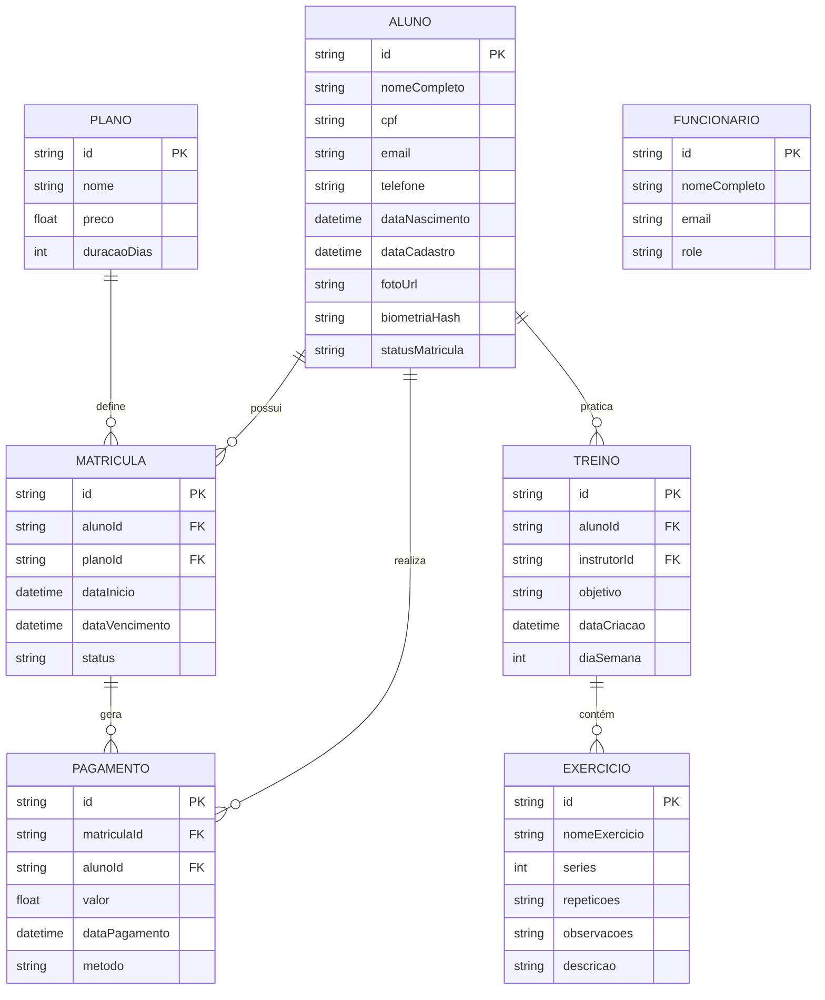

# Documento de Modelos - SmartManagementSystem (SMS)

Este documento apresenta o Modelo Conceitual e o Dicionário de Dados para o **SmartManagementSystem (SMS)**.

## Modelo Conceitual

Abaixo apresentamos o modelo conceitual usando o **Mermaid**, refletindo a estrutura de dados do Firestore.

## Dicionário de Dados

### Entidade: Aluno

| Atributo        | Tipo   | Descrição                                             |
| --------------- | ------ | ----------------------------------------------------- |
| id              | String | UID do Firebase Authentication.                       |
| nomeCompleto    | String | Nome civil completo.                                  |
| cpf             | String | Cadastro de Pessoa Física (formatado).                |
| email           | String | Endereço de e-mail eletrônico.                        |
| statusMatricula | Enum   | Situação da matrícula (ATIVA, INADIMPLENTE, INATIVA). |

### Entidade: Plano

| Atributo    | Tipo   | Descrição                                |
| ----------- | ------ | ---------------------------------------- |
| id          | String | Identificador único do plano.            |
| nome        | String | Nome comercial (ex: Mensal, Trimestral). |
| preco       | Number | Valor monetário do plano.                |
| duracaoDias | Number | Validade do plano em dias corridos.      |

### Entidade: Treino

| Atributo    | Tipo   | Descrição                                         |
| ----------- | ------ | ------------------------------------------------- |
| id          | String | Identificador único do treino.                    |
| alunoId     | String | Referência ao aluno proprietário.                 |
| instrutorId | String | Referência ao funcionário ou "IA".                |
| objetivo    | String | Objetivo físico (ex: Hipertrofia, Emagrecimento). |

### Entidade: Funcionário

| Atributo     | Tipo   | Descrição                                   |
| ------------ | ------ | ------------------------------------------- |
| id           | String | UID do Firebase Authentication.             |
| nomeCompleto | String | Nome civil do colaborador.                  |
| role         | Enum   | Função (RECEPCIONISTA, INSTRUTOR, GERENTE). |

---

### Referências

- [Estrutura JSON do Backend](backend.json)
