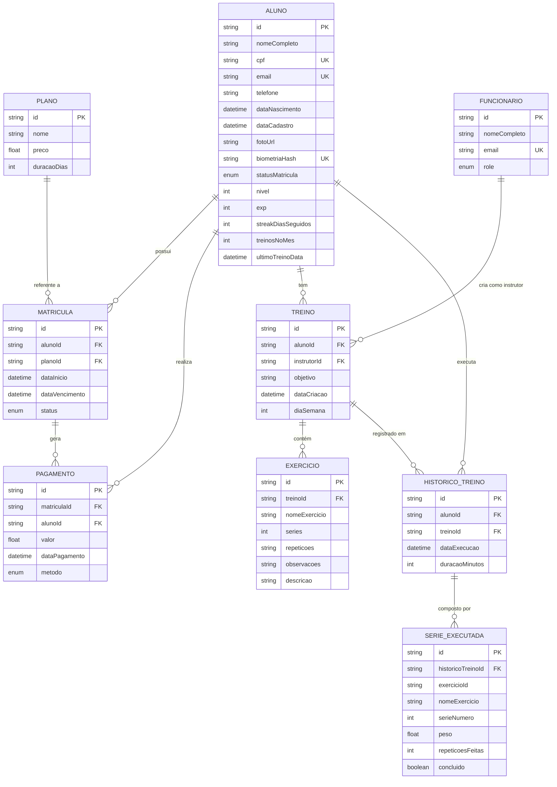

# Documento de Modelos -- Sistema Five Star Academy

## Histórico de Revisão

| Versão | Data       | Autor | Descrição                |
| ------ | ---------- | ----- | ------------------------ |
| 1.0    | 2026-07-02 | --    | Versão inicial do modelo |

---

## 1. Introdução

### 1.1 Propósito

Este documento descreve o modelo de dados do Sistema de Gestão Five Star Academy. Ele serve como referência única para a estrutura do banco de dados, relacionamentos entre entidades, tipos de dados e restrições de integridade. Todas as decisões de implementação no banco de dados devem respeitar o que aqui está definido.

### 1.2 Escopo

O escopo cobre todas as entidades, atributos, relacionamentos e enums mapeados no schema Prisma, utilizado como ORM oficial do projeto. O banco de dados relacional subjacente é PostgreSQL, hospedado no Supabase.

### 1.3 Convenções

- Chaves primárias são UUIDs geradas automaticamente via `gen_random_uuid()`.
- Nomes de tabelas no banco seguem o padrão `snake_case` no plural.
- Nomes de campos seguem `camelCase` no Prisma e `snake_case` no banco.
- Campos de data usam o tipo `DateTime` do Prisma, que mapeia para `timestamp(3)` (sem fuso horário) no PostgreSQL.
- Toda constraint de chave estrangeira está explicitamente declarada no schema.

---

## 2. Diagrama Entidade-Relacionamento (DER)

O diagrama abaixo representa graficamente as entidades, atributos e relacionamentos do sistema.

---

## 3. Descrição das Entidades

### 3.1 Funcionario

Representa um funcionário da academia. Pode atuar como gerente, recepcionista ou instrutor. Funcionários com papel `INSTRUTOR` podem ser vinculados a treinos como responsáveis pela criação.

| Campo          | Tipo   | Descrição                                    | Restrições             |
| -------------- | ------ | -------------------------------------------- | ---------------------- |
| `id`           | String | Identificador único do funcionário (UUID v4) | PK, gerado auto        |
| `nomeCompleto` | String | Nome completo do funcionário                 | Obrigatório            |
| `email`        | String | Email corporativo do funcionário             | UNIQUE, obrigatório    |
| `role`         | Role   | Papel do funcionário no sistema              | Default: RECEPCIONISTA |

**Relacionamentos:**

| Relacionamento | Entidade | Tipo     | Descrição                                            |
| -------------- | -------- | -------- | ---------------------------------------------------- |
| Treinos        | Treino   | 1 para N | Um funcionário (instrutor) pode criar vários treinos |

**Mapeamento:** `funcionarios`

---

### 3.2 Aluno

Entidade central do sistema. Representa uma pessoa física matriculada na academia. Inclui dados pessoais, métricas de gamificação (nível, XP, streak) e controle de frequência.

| Campo                | Tipo        | Descrição                                        | Restrições          |
| -------------------- | ----------- | ------------------------------------------------ | ------------------- |
| `id`                 | String      | Identificador único do aluno (UUID v4)           | PK, gerado auto     |
| `nomeCompleto`       | String      | Nome completo do aluno                           | Obrigatório         |
| `cpf`                | String      | Cadastro de Pessoa Física (CPF)                  | UNIQUE, obrigatório |
| `email`              | String      | Email do aluno para contato e notificações       | UNIQUE, obrigatório |
| `telefone`           | String?     | Número de telefone celular ou fixo               | Opcional            |
| `dataNascimento`     | DateTime?   | Data de nascimento do aluno                      | Opcional            |
| `dataCadastro`       | DateTime    | Data em que o aluno foi cadastrado no sistema    | Default: now()      |
| `fotoUrl`            | String?     | URL da foto de perfil do aluno                   | Opcional            |
| `biometriaHash`      | String?     | Hash de biometria para identificação biométrica  | UNIQUE, opcional    |
| `statusMatricula`    | StatusAluno | Situação atual da matrícula do aluno             | Default: ATIVA      |
| `nivel`              | Int         | Nível atual do aluno no sistema de gamificação   | Default: 1          |
| `exp`                | Int         | Pontos de experiência acumulados                 | Default: 0          |
| `streakDiasSeguidos` | Int         | Dias consecutivos de treino (ofensiva)           | Default: 0          |
| `treinosNoMes`       | Int         | Quantidade de treinos realizados no mês corrente | Default: 0          |
| `ultimoTreinoData`   | DateTime?   | Data e hora do último treino registrado do aluno | Opcional            |

**Relacionamentos:**

| Relacionamento   | Entidade        | Tipo     | Descrição                                               |
| ---------------- | --------------- | -------- | ------------------------------------------------------- |
| HistoricoTreinos | HistoricoTreino | 1 para N | Um aluno possui vários registros de histórico de treino |
| Matriculas       | Matricula       | 1 para N | Um aluno pode ter várias matrículas ao longo do tempo   |
| Pagamentos       | Pagamento       | 1 para N | Um aluno realiza vários pagamentos                      |
| Treinos          | Treino          | 1 para N | Um aluno possui vários treinos cadastrados              |

**Mapeamento:** `alunos`

---

### 3.3 Plano

Representa um plano de assinatura oferecido pela academia. Cada plano possui um preço e uma duração em dias. Planos são associados a matrículas.

| Campo         | Tipo   | Descrição                              | Restrições      |
| ------------- | ------ | -------------------------------------- | --------------- |
| `id`          | String | Identificador único do plano (UUID v4) | PK, gerado auto |
| `nome`        | String | Nome do plano (ex.: Básico, Premium)   | Obrigatório     |
| `preco`       | Float  | Valor monetário do plano               | Obrigatório     |
| `duracaoDias` | Int    | Duração do plano em dias               | Obrigatório     |

**Relacionamentos:**

| Relacionamento | Entidade  | Tipo     | Descrição                                         |
| -------------- | --------- | -------- | ------------------------------------------------- |
| Matriculas     | Matricula | 1 para N | Um plano pode estar associado a várias matrículas |

**Mapeamento:** `planos`

---

### 3.4 Matricula

Registra a assinatura de um aluno a um plano em um período específico. Controla a data de início, vencimento e status da matrícula.

| Campo            | Tipo            | Descrição                                  | Restrições      |
| ---------------- | --------------- | ------------------------------------------ | --------------- |
| `id`             | String          | Identificador único da matrícula (UUID v4) | PK, gerado auto |
| `alunoId`        | String          | FK para o aluno matriculado                | Obrigatório     |
| `planoId`        | String          | FK para o plano contratado                 | Obrigatório     |
| `dataInicio`     | DateTime        | Data de início da vigência da matrícula    | Default: now()  |
| `dataVencimento` | DateTime        | Data de término da vigência                | Obrigatório     |
| `status`         | StatusMatricula | Situação atual da matrícula                | Default: ATIVA  |

**Relacionamentos:**

| Relacionamento | Entidade  | Tipo     | Descrição                                  |
| -------------- | --------- | -------- | ------------------------------------------ |
| Aluno          | Aluno     | N para 1 | Uma matrícula pertence a um aluno          |
| Plano          | Plano     | N para 1 | Uma matrícula referencia um plano          |
| Pagamentos     | Pagamento | 1 para N | Uma matrícula pode gerar vários pagamentos |

**Índices:** `alunoId`, `status`

**Mapeamento:** `matriculas`

---

### 3.5 Pagamento

Registra pagamentos realizados por alunos, vinculados a uma matrícula. Permite controle financeiro e identificação de inadimplência.

| Campo           | Tipo            | Descrição                                     | Restrições      |
| --------------- | --------------- | --------------------------------------------- | --------------- |
| `id`            | String          | Identificador único do pagamento (UUID v4)    | PK, gerado auto |
| `matriculaId`   | String          | FK para a matrícula referente                 | Obrigatório     |
| `alunoId`       | String          | FK para o aluno pagador                       | Obrigatório     |
| `valor`         | Float           | Valor pago                                    | Obrigatório     |
| `dataPagamento` | DateTime        | Data e hora em que o pagamento foi registrado | Default: now()  |
| `metodo`        | MetodoPagamento | Forma de pagamento utilizada                  | Obrigatório     |

**Relacionamentos:**

| Relacionamento | Entidade  | Tipo     | Descrição                                   |
| -------------- | --------- | -------- | ------------------------------------------- |
| Aluno          | Aluno     | N para 1 | Um pagamento pertence a um aluno            |
| Matricula      | Matricula | N para 1 | Um pagamento está vinculado a uma matrícula |

**Índices:** `alunoId`, `dataPagamento`

**Mapeamento:** `pagamentos`

---

### 3.6 Treino

Representa um plano de treino criado para um aluno. Pode ser associado a um instrutor (funcionário com papel INSTRUTOR). Inclui um objetivo e, opcionalmente, um dia da semana para execução.

| Campo         | Tipo     | Descrição                                          | Restrições      |
| ------------- | -------- | -------------------------------------------------- | --------------- |
| `id`          | String   | Identificador único do treino (UUID v4)            | PK, gerado auto |
| `alunoId`     | String   | FK para o aluno dono do treino                     | Obrigatório     |
| `instrutorId` | String?  | FK para o funcionário que criou o treino           | Opcional        |
| `objetivo`    | String   | Descrição do objetivo do treino (ex.: Hipertrofia) | Obrigatório     |
| `dataCriacao` | DateTime | Data de criação do treino                          | Default: now()  |
| `diaSemana`   | Int?     | Dia da semana para execução (0=domingo a 6=sábado) | Opcional        |

**Relacionamentos:**

| Relacionamento   | Entidade        | Tipo     | Descrição                                        |
| ---------------- | --------------- | -------- | ------------------------------------------------ |
| Exercicios       | Exercicio       | 1 para N | Um treino contém vários exercícios               |
| HistoricoTreinos | HistoricoTreino | 1 para N | Um treino pode ter vários registros de execução  |
| Aluno            | Aluno           | N para 1 | Um treino pertence a um aluno                    |
| Instrutor        | Funcionario     | N para 1 | Um treino foi criado por um instrutor (opcional) |

**Índices:** `alunoId`

**Mapeamento:** `treinos`

---

### 3.7 Exercicio

Representa um exercício pertencente a um treino. Inclui nome, número de séries, repetições e observações adicionais.

| Campo           | Tipo    | Descrição                                      | Restrições      |
| --------------- | ------- | ---------------------------------------------- | --------------- |
| `id`            | String  | Identificador único do exercício (UUID v4)     | PK, gerado auto |
| `treinoId`      | String  | FK para o treino ao qual o exercício pertence  | Obrigatório     |
| `nomeExercicio` | String  | Nome do exercício (ex.: Supino Reto)           | Obrigatório     |
| `series`        | Int     | Quantidade de séries previstas                 | Obrigatório     |
| `repeticoes`    | String  | Número de repetições por série (ex.: 12, 8-10) | Obrigatório     |
| `observacoes`   | String? | Observações adicionais sobre o exercício       | Opcional        |
| `descricao`     | String? | Descrição detalhada da execução do exercício   | Opcional        |

**Relacionamentos:**

| Relacionamento | Entidade | Tipo     | Descrição                         |
| -------------- | -------- | -------- | --------------------------------- |
| Treino         | Treino   | N para 1 | Um exercício pertence a um treino |

**Nota:** A exclusão de um treino (`onDelete: Cascade`) propaga para seus exercícios.

**Mapeamento:** `exercicios`

---

### 3.8 HistoricoTreino

Registra a execução de um treino por um aluno em uma data específica. Armazena a duração e o conjunto de séries executadas.

| Campo            | Tipo     | Descrição                                  | Restrições      |
| ---------------- | -------- | ------------------------------------------ | --------------- |
| `id`             | String   | Identificador único do histórico (UUID v4) | PK, gerado auto |
| `alunoId`        | String   | FK para o aluno que executou o treino      | Obrigatório     |
| `treinoId`       | String   | FK para o treino executado                 | Obrigatório     |
| `dataExecucao`   | DateTime | Data e hora da execução do treino          | Default: now()  |
| `duracaoMinutos` | Int      | Duração total do treino em minutos         | Obrigatório     |

**Relacionamentos:**

| Relacionamento   | Entidade       | Tipo     | Descrição                                              |
| ---------------- | -------------- | -------- | ------------------------------------------------------ |
| Aluno            | Aluno          | N para 1 | Um histórico de treino pertence a um aluno             |
| Treino           | Treino         | N para 1 | Um histórico de treino referencia um treino            |
| SeriesExecutadas | SerieExecutada | 1 para N | Um histórico de treino contém várias séries executadas |

**Índices:** `(alunoId, dataExecucao)`

**Mapeamento:** `historico_treinos`

---

### 3.9 SerieExecutada

Registro detalhado de cada série executada durante um treino. Inclui o exercício, número da série, peso utilizado, repetições feitas e se foi concluída.

| Campo               | Tipo    | Descrição                                                | Restrições      |
| ------------------- | ------- | -------------------------------------------------------- | --------------- |
| `id`                | String  | Identificador único da série executada (UUID v4)         | PK, gerado auto |
| `historicoTreinoId` | String  | FK para o histórico de treino                            | Obrigatório     |
| `exercicioId`       | String  | ID do exercício executado (snapshot — ref denormalizada) | Obrigatório     |
| `nomeExercicio`     | String  | Nome do exercício no momento da execução                 | Obrigatório     |
| `serieNumero`       | Int     | Número ordinal da série (1, 2, 3, ...)                   | Obrigatório     |
| `peso`              | Float?  | Carga utilizada na série em kg                           | Opcional        |
| `repeticoesFeitas`  | Int?    | Quantidade de repetições efetivamente realizadas         | Opcional        |
| `concluido`         | Boolean | Indica se a série foi concluída com sucesso              | Default: false  |

**Relacionamentos:**

| Relacionamento  | Entidade        | Tipo     | Descrição                                             |
| --------------- | --------------- | -------- | ----------------------------------------------------- |
| HistoricoTreino | HistoricoTreino | N para 1 | Uma série executada pertence a um histórico de treino |

**Nota:** A exclusão de um histórico de treino (`onDelete: Cascade`) propaga para suas séries executadas.

**Índices:** `historicoTreinoId`

**Mapeamento:** `series_executadas`

---

## 4. Enumeradores

### 4.1 Role

Define os papéis que um funcionário pode assumir no sistema.

| Valor           | Descrição                                                |
| --------------- | -------------------------------------------------------- |
| `GERENTE`       | Acesso completo ao sistema, incluindo financeiro e dados |
| `RECEPCIONISTA` | Acesso a cadastro de alunos e matrículas                 |
| `INSTRUTOR`     | Acesso a criação e gerenciamento de treinos              |

### 4.2 StatusAluno

Define a situação geral do aluno na academia.

| Valor          | Descrição                                            |
| -------------- | ---------------------------------------------------- |
| `ATIVA`        | Aluno com matrícula ativa e em dia                   |
| `INADIMPLENTE` | Aluno com pagamentos pendentes ou em atraso          |
| `INATIVA`      | Aluno sem matrícula vigente ou desligado da academia |

### 4.3 StatusMatricula

Define a situação de uma matrícula específica.

| Valor     | Descrição                                 |
| --------- | ----------------------------------------- |
| `ATIVA`   | Matrícula dentro do período de vigência   |
| `VENCIDA` | Matrícula com data de vencimento expirada |

### 4.4 MetodoPagamento

Formas de pagamento aceitas pela academia.

| Valor      | Descrição                                 |
| ---------- | ----------------------------------------- |
| `PIX`      | Pagamento via PIX                         |
| `DINHEIRO` | Pagamento em espécie                      |
| `CARTAO`   | Pagamento com cartão de crédito ou débito |

---

## 5. Dicionário de Dados

Tabela consolidada com todos os atributos do sistema, organizados por entidade.

### 5.1 Entidade: Funcionario (`funcionarios`)

| Atributo     | Tipo Prisma | Tipo PostgreSQL | PK  | FK  | UNIQUE | Obrigatório | Default           |
| ------------ | ----------- | --------------- | --- | --- | ------ | ----------- | ----------------- |
| id           | String      | text            | PK  | -   | -      | Sim         | gen_random_uuid() |
| nomeCompleto | String      | text            | -   | -   | -      | Sim         | -                 |
| email        | String      | text            | -   | -   | Sim    | Sim         | -                 |
| role         | Role        | "Role"          | -   | -   | -      | Sim         | RECEPCIONISTA     |

### 5.2 Entidade: Aluno (`alunos`)

| Atributo           | Tipo Prisma | Tipo PostgreSQL | PK  | FK  | UNIQUE | Obrigatório | Default           |
| ------------------ | ----------- | --------------- | --- | --- | ------ | ----------- | ----------------- |
| id                 | String      | text            | PK  | -   | -      | Sim         | gen_random_uuid() |
| nomeCompleto       | String      | text            | -   | -   | -      | Sim         | -                 |
| cpf                | String      | text            | -   | -   | Sim    | Sim         | -                 |
| email              | String      | text            | -   | -   | Sim    | Sim         | -                 |
| telefone           | String?     | text            | -   | -   | -      | Não         | -                 |
| dataNascimento     | DateTime?   | timestamp(3)    | -   | -   | -      | Não         | -                 |
| dataCadastro       | DateTime    | timestamp(3)    | -   | -   | -      | Sim         | now()             |
| fotoUrl            | String?     | text            | -   | -   | -      | Não         | -                 |
| biometriaHash      | String?     | text            | -   | -   | Sim    | Não         | -                 |
| statusMatricula    | StatusAluno | "StatusAluno"   | -   | -   | -      | Sim         | ATIVA             |
| nivel              | Int         | integer         | -   | -   | -      | Sim         | 1                 |
| exp                | Int         | integer         | -   | -   | -      | Sim         | 0                 |
| streakDiasSeguidos | Int         | integer         | -   | -   | -      | Sim         | 0                 |
| treinosNoMes       | Int         | integer         | -   | -   | -      | Sim         | 0                 |
| ultimoTreinoData   | DateTime?   | timestamp(3)    | -   | -   | -      | Não         | -                 |

### 5.3 Entidade: Plano (`planos`)

| Atributo    | Tipo Prisma | Tipo PostgreSQL  | PK  | FK  | UNIQUE | Obrigatório | Default           |
| ----------- | ----------- | ---------------- | --- | --- | ------ | ----------- | ----------------- |
| id          | String      | text             | PK  | -   | -      | Sim         | gen_random_uuid() |
| nome        | String      | text             | -   | -   | -      | Sim         | -                 |
| preco       | Float       | double precision | -   | -   | -      | Sim         | -                 |
| duracaoDias | Int         | integer          | -   | -   | -      | Sim         | -                 |

### 5.4 Entidade: Matricula (`matriculas`)

| Atributo       | Tipo Prisma     | Tipo PostgreSQL   | PK  | FK           | UNIQUE | Obrigatório | Default           |
| -------------- | --------------- | ----------------- | --- | ------------ | ------ | ----------- | ----------------- |
| id             | String          | text              | PK  | -            | -      | Sim         | gen_random_uuid() |
| alunoId        | String          | text              | -   | FK->Aluno.id | -      | Sim         | -                 |
| planoId        | String          | text              | -   | FK->Plano.id | -      | Sim         | -                 |
| dataInicio     | DateTime        | timestamp(3)      | -   | -            | -      | Sim         | now()             |
| dataVencimento | DateTime        | timestamp(3)      | -   | -            | -      | Sim         | -                 |
| status         | StatusMatricula | "StatusMatricula" | -   | -            | -      | Sim         | ATIVA             |

### 5.5 Entidade: Pagamento (`pagamentos`)

| Atributo      | Tipo Prisma     | Tipo PostgreSQL   | PK  | FK               | UNIQUE | Obrigatório | Default           |
| ------------- | --------------- | ----------------- | --- | ---------------- | ------ | ----------- | ----------------- |
| id            | String          | text              | PK  | -                | -      | Sim         | gen_random_uuid() |
| matriculaId   | String          | text              | -   | FK->Matricula.id | -      | Sim         | -                 |
| alunoId       | String          | text              | -   | FK->Aluno.id     | -      | Sim         | -                 |
| valor         | Float           | double precision  | -   | -                | -      | Sim         | -                 |
| dataPagamento | DateTime        | timestamp(3)      | -   | -                | -      | Sim         | now()             |
| metodo        | MetodoPagamento | "MetodoPagamento" | -   | -                | -      | Sim         | -                 |

### 5.6 Entidade: Treino (`treinos`)

| Atributo    | Tipo Prisma | Tipo PostgreSQL | PK  | FK                 | UNIQUE | Obrigatório | Default           |
| ----------- | ----------- | --------------- | --- | ------------------ | ------ | ----------- | ----------------- |
| id          | String      | text            | PK  | -                  | -      | Sim         | gen_random_uuid() |
| alunoId     | String      | text            | -   | FK->Aluno.id       | -      | Sim         | -                 |
| instrutorId | String?     | text            | -   | FK->Funcionario.id | -      | Não         | -                 |
| objetivo    | String      | text            | -   | -                  | -      | Sim         | -                 |
| dataCriacao | DateTime    | timestamp(3)    | -   | -                  | -      | Sim         | now()             |
| diaSemana   | Int?        | integer         | -   | -                  | -      | Não         | -                 |

### 5.7 Entidade: Exercicio (`exercicios`)

| Atributo      | Tipo Prisma | Tipo PostgreSQL | PK  | FK            | UNIQUE | Obrigatório | Default           |
| ------------- | ----------- | --------------- | --- | ------------- | ------ | ----------- | ----------------- |
| id            | String      | text            | PK  | -             | -      | Sim         | gen_random_uuid() |
| treinoId      | String      | text            | -   | FK->Treino.id | -      | Sim         | -                 |
| nomeExercicio | String      | text            | -   | -             | -      | Sim         | -                 |
| series        | Int         | integer         | -   | -             | -      | Sim         | -                 |
| repeticoes    | String      | text            | -   | -             | -      | Sim         | -                 |
| observacoes   | String?     | text            | -   | -             | -      | Não         | -                 |
| descricao     | String?     | text            | -   | -             | -      | Não         | -                 |

### 5.8 Entidade: HistoricoTreino (`historico_treinos`)

| Atributo       | Tipo Prisma | Tipo PostgreSQL | PK  | FK            | UNIQUE | Obrigatório | Default           |
| -------------- | ----------- | --------------- | --- | ------------- | ------ | ----------- | ----------------- |
| id             | String      | text            | PK  | -             | -      | Sim         | gen_random_uuid() |
| alunoId        | String      | text            | -   | FK->Aluno.id  | -      | Sim         | -                 |
| treinoId       | String      | text            | -   | FK->Treino.id | -      | Sim         | -                 |
| dataExecucao   | DateTime    | timestamp(3)    | -   | -             | -      | Sim         | now()             |
| duracaoMinutos | Int         | integer         | -   | -             | -      | Sim         | -                 |

### 5.9 Entidade: SerieExecutada (`series_executadas`)

| Atributo          | Tipo Prisma | Tipo PostgreSQL  | PK  | FK                     | UNIQUE | Obrigatório | Default           |
| ----------------- | ----------- | ---------------- | --- | ---------------------- | ------ | ----------- | ----------------- |
| id                | String      | text             | PK  | -                      | -      | Sim         | gen_random_uuid() |
| historicoTreinoId | String      | text             | -   | FK->HistoricoTreino.id | -      | Sim         | -                 |
| exercicioId       | String      | text             | -   | -                      | -      | Sim         | -                 |
| nomeExercicio     | String      | text             | -   | -                      | -      | Sim         | -                 |
| serieNumero       | Int         | integer          | -   | -                      | -      | Sim         | -                 |
| peso              | Float?      | double precision | -   | -                      | -      | Não         | -                 |
| repeticoesFeitas  | Int?        | integer          | -   | -                      | -      | Não         | -                 |
| concluido         | Boolean     | boolean          | -   | -                      | -      | Sim         | false             |

---

## 6. Regras de Integridade e Restrições

### 6.1 Integridade Referencial

Todas as chaves estrangeiras são explicitamente definidas e garantem integridade referencial:

| FK                                   | Tabela Origem       | Tabela Destino      | Comportamento OnDelete |
| ------------------------------------ | ------------------- | ------------------- | ---------------------- |
| `alunoId` (Matricula)                | `matriculas`        | `alunos`            | Restrict (padrão)      |
| `planoId` (Matricula)                | `matriculas`        | `planos`            | Restrict (padrão)      |
| `matriculaId` (Pagamento)            | `pagamentos`        | `matriculas`        | Restrict (padrão)      |
| `alunoId` (Pagamento)                | `pagamentos`        | `alunos`            | Restrict (padrão)      |
| `alunoId` (Treino)                   | `treinos`           | `alunos`            | Restrict (padrão)      |
| `instrutorId` (Treino)               | `treinos`           | `funcionarios`      | Restrict (padrão)      |
| `treinoId` (Exercicio)               | `exercicios`        | `treinos`           | Cascade                |
| `alunoId` (HistoricoTreino)          | `historico_treinos` | `alunos`            | Restrict (padrão)      |
| `treinoId` (HistoricoTreino)         | `historico_treinos` | `treinos`           | Restrict (padrão)      |
| `historicoTreinoId` (SerieExecutada) | `series_executadas` | `historico_treinos` | Cascade                |

### 6.2 Restrições de Unicidade

- `email` em `funcionarios`: único. Não podem existir dois funcionários com o mesmo email.
- `cpf` em `alunos`: único. Cada CPF só pode ser cadastrado uma vez.
- `email` em `alunos`: único. Não podem existir dois alunos com o mesmo email.
- `biometriaHash` em `alunos`: único. Cada biometria só pode ser associada a um único aluno.

### 6.3 Restrições de Domínio

- `role` em `funcionarios`: deve ser um dos valores do enum `Role` (GERENTE, RECEPCIONISTA, INSTRUTOR).
- `statusMatricula` em `alunos`: deve ser um dos valores do enum `StatusAluno` (ATIVA, INADIMPLENTE, INATIVA).
- `status` em `matriculas`: deve ser um dos valores do enum `StatusMatricula` (ATIVA, VENCIDA).
- `metodo` em `pagamentos`: deve ser um dos valores do enum `MetodoPagamento` (PIX, DINHEIRO, CARTAO).
- `nivel` em `alunos`: inteiro positivo. Valor mínimo: 1.
- `exp` em `alunos`: inteiro não negativo.
- `streakDiasSeguidos` em `alunos`: inteiro não negativo.
- `treinosNoMes` em `alunos`: inteiro não negativo.
- `series` em `exercicios`: inteiro positivo.
- `serieNumero` em `SerieExecutada`: inteiro positivo.
- `duracaoMinutos` em `HistoricoTreino`: inteiro positivo.
- `preco` em `planos`: valor real positivo.
- `duracaoDias` em `planos`: inteiro positivo.
- `diaSemana` em `treinos`: valores de 0 (domingo) a 6 (sábado), quando preenchido.

### 6.4 Regras de Negócio

1. **Matrícula ativa por aluno:** Um aluno pode ter múltiplas matrículas ao longo do tempo, mas apenas uma matrícula com status `ATIVA` por vez é permitida (aplicação deve garantir).
2. **Treino vinculado a instrutor:** O campo `instrutorId` em `Treino` é opcional. Quando preenchido, deve referenciar um `Funcionario` com papel `INSTRUTOR` ou `GERENTE` (aplicação deve validar).
3. **Cascade em Exercicio:** A exclusão de um `Treino` propaga para todos os `Exercicio` vinculados. Não é possível manter exercícios órfãos.
4. **Cascade em SerieExecutada:** A exclusão de um `HistoricoTreino` propaga para todas as `SerieExecutada` vinculadas.
5. **Gamificação:** Os campos `nivel`, `exp`, `streakDiasSeguidos` e `treinosNoMes` em `Aluno` são gerenciados pela aplicação com base na frequência e conclusão de treinos.
6. **Data de vencimento:** Toda `Matricula` deve possuir `dataVencimento` posterior a `dataInicio` (aplicação deve validar).
7. **Série executada desnormalizada:** O campo `nomeExercicio` em `SerieExecutada` replica o nome do exercício no momento da execução, permitindo que o histórico permaneça legível mesmo se o exercício original for alterado.

---

## 7. Glossário

| Termo       | Significado                                                 |
| ----------- | ----------------------------------------------------------- |
| UUID        | Identificador universal único, gerado aleatoriamente        |
| PK          | Primary Key (Chave Primária)                                |
| FK          | Foreign Key (Chave Estrangeira)                             |
| XP          | Pontos de experiência do sistema de gamificação             |
| Streak      | Sequência de dias consecutivos de treino (ofensiva)         |
| Cascade     | Propagação de exclusão em cascata nas relações              |
| Restrict    | Impede exclusão se houver registros dependentes             |
| Gamificação | Uso de elementos de jogos (nível, XP) para engajar usuários |
