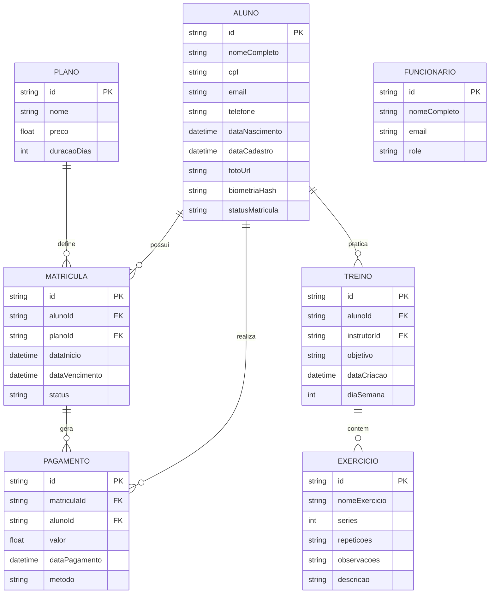

# SPEC-001: Data Models & Dictionary

**Date:** 2026-04-08
**Status:** Approved
**Target:** PostgreSQL via Prisma ORM

---

## 1. Conceptual ERD

## 2. Data Dictionary

_Note: Legacy documents referenced Firebase UIDs. The architecture has since migrated to Supabase Auth + PostgreSQL via Prisma. The `id` fields represent UUIDs linked to Supabase `auth.users` where applicable._

### Entity: Aluno (Student)

| Attribute         | Type        | Description                                         |
| ----------------- | ----------- | --------------------------------------------------- |
| `id`              | UUID/String | Primary Key (matches Supabase Auth UID).            |
| `nomeCompleto`    | String      | Full legal name.                                    |
| `cpf`             | String      | Formatted CPF document.                             |
| `email`           | String      | Electronic mail address.                            |
| `statusMatricula` | Enum        | Current status: `ATIVA`, `INADIMPLENTE`, `INATIVA`. |

### Entity: Plano (Subscription Plan)

| Attribute     | Type          | Description                                 |
| ------------- | ------------- | ------------------------------------------- |
| `id`          | UUID/String   | Primary Key.                                |
| `nome`        | String        | Commercial name (e.g., Monthly, Quarterly). |
| `preco`       | Float/Decimal | Monetary value.                             |
| `duracaoDias` | Integer       | Validity in days.                           |

### Entity: Treino (Workout)

| Attribute     | Type        | Description                                                       |
| ------------- | ----------- | ----------------------------------------------------------------- |
| `id`          | UUID/String | Primary Key.                                                      |
| `alunoId`     | UUID/String | Foreign Key referencing Aluno.                                    |
| `instrutorId` | UUID/String | Foreign Key referencing Funcionário (or 'IA' for auto-generated). |
| `objetivo`    | String      | Physical objective (e.g., Hypertrophy, Weight Loss).              |

### Entity: Funcionário (Staff)

| Attribute      | Type        | Description                                                      |
| -------------- | ----------- | ---------------------------------------------------------------- |
| `id`           | UUID/String | Primary Key (matches Supabase Auth UID).                         |
| `nomeCompleto` | String      | Full legal name.                                                 |
| `role`         | Enum        | System permission role: `RECEPCIONISTA`, `INSTRUTOR`, `GERENTE`. |
